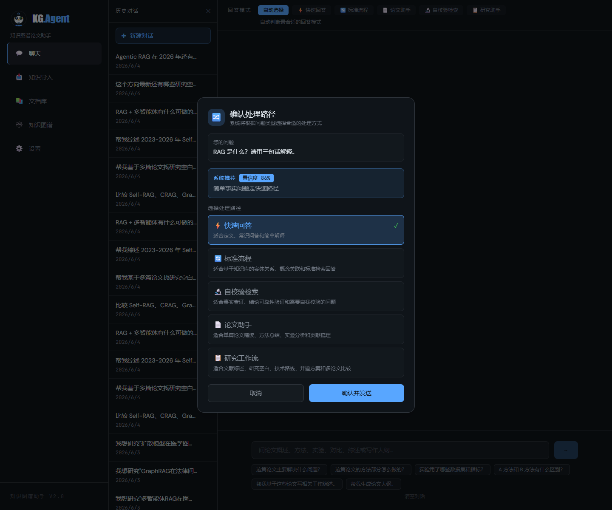
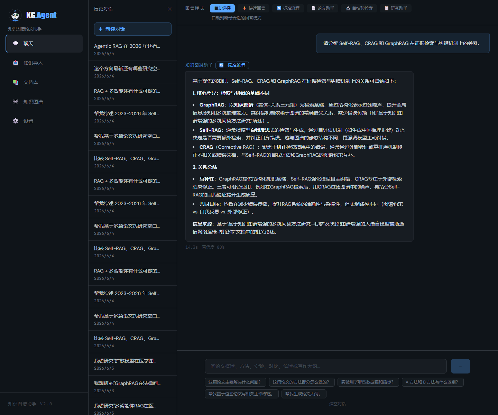
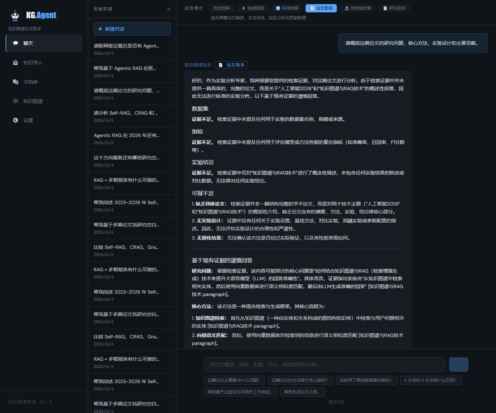
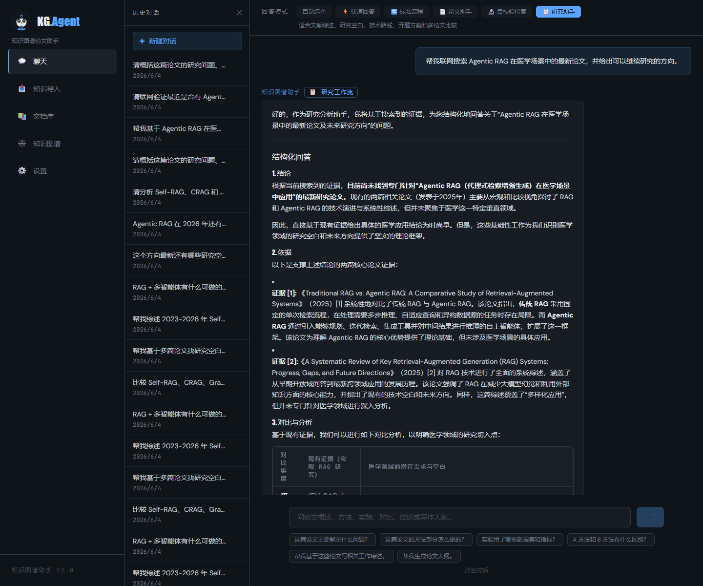
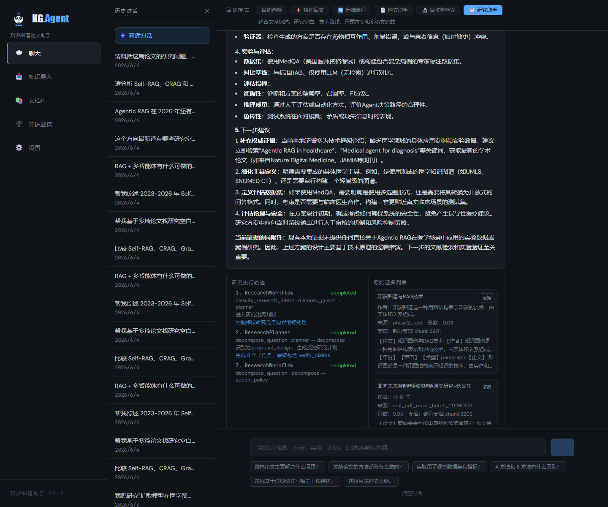
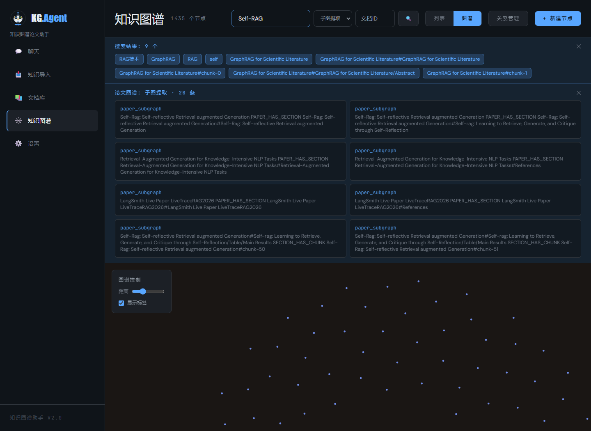

# KG-Agent System v3

<p align="center">
  
</p>

<p align="center">
  <strong>面向论文阅读、研究选题与知识沉淀的知识图谱增强 RAG 研究工作台</strong>
</p>

<p align="center">
  
  
  
  
  
</p>

KG-Agent 把论文阅读、研究选题、证据验证、学术联网检索和知识图谱沉淀放在同一个界面里。它不是只回答“文档里有什么”，而是根据问题自动选择合适工作流：简单定义快速回答，复杂分析走知识库流程，单篇论文交给论文助手，研究方案进入 Research Workflow，最新或验证类问题触发 Self-RAG / 联网补证。

## 一眼看懂它能做什么

| 使用阶段 | 你可以直接这样问 | 系统会做什么 |
| --- | --- | --- |
| 先理解概念 | `RAG 是什么？请用三句话解释。` | 快速解释基础概念，不启动复杂检索流程。 |
| 再比较方法 | `请分析 Self-RAG、CRAG 和 GraphRAG 在证据检索与纠错机制上的关系。` | 对比多个方法的机制、差异、适用场景和证据来源。 |
| 精读一篇论文 | `请概括这篇论文的研究问题、核心方法、实验设计和主要贡献。` | 基于本地论文分片整理研究问题、方法、实验和贡献。 |
| 查看证据来源 | `帮我联网搜索 Agentic RAG 在医学场景中的最新论文，并给出可以继续研究的方向。` | 在本地证据不足或需要最新资料时补充联网证据和来源链接。 |
| 验证最新判断 | `请联网验证最近是否有 Agentic RAG 在医学场景中的新论文。` | 使用 Self-RAG / 联网补证判断结论是否有证据支撑。 |
| 形成研究方案 | `帮我基于 Agentic RAG 在医学场景中的应用，设计一个可做的研究方案。` | 从方向拆解到研究问题、技术路线、风险和下一步资料需求。 |
| 沉淀知识图谱 | `搜索 Self-RAG 相关概念，并查看它和 RAG、反思机制、事实性评估之间的关系。` | 把论文、概念、方法和关系变成可检索、可探索的图谱。 |

## 这个项目可以做什么

下面按真实研究流程从简单到复杂展示 KG-Agent 的主要能力。每个例子都来自本地前后端实际运行，截图直接展示问题提交后的结果界面。

### 1. 快速理解基础概念

**问题**

```text
RAG 是什么？请用三句话解释。
```

**结果截图**

<p align="center">
  
</p>

简单定义会走快速回答路径，不会被复杂工作流拖慢。

### 2. 比较多个 RAG 方法

**问题**

```text
请分析 Self-RAG、CRAG 和 GraphRAG 在证据检索与纠错机制上的关系。
```

**结果截图**

<p align="center">
  
</p>

复杂方法比较会进入知识库分析流程，系统会组织概念关系、机制差异、适用场景和来源证据。

### 3. 阅读并总结单篇论文

**问题**

```text
请概括这篇论文的研究问题、核心方法、实验设计和主要贡献。
```

**结果截图**

<p align="center">
  
</p>

Paper Assistant 会优先读取本地论文分片，围绕方法、实验、贡献和局限组织回答，而不是泛泛总结。

### 4. 证据不足时联网补充并生成来源链接

**问题**

```text
帮我联网搜索 Agentic RAG 在医学场景中的最新论文，并给出可以继续研究的方向。
```

**结果截图**

<p align="center">
  
</p>

当本地证据不足或用户明确要求“联网 / 最新论文”时，Research Workflow 会补充学术或网页证据，并把论文标题、来源、URL 和支撑状态展示出来。

### 5. 查找并验证最新论文

**问题**

```text
请联网验证最近是否有 Agentic RAG 在医学场景中的新论文。
```

**结果截图**

<p align="center">
  
</p>

这个问题包含“最近”“联网验证”“医学场景”“新论文”，系统会触发 Self-RAG / 联网补证，返回论文来源、URL、摘要和证据支撑状态。

### 6. 从研究方向生成可做方案

**问题**

```text
帮我基于 Agentic RAG 在医学场景中的应用，设计一个可做的研究方案。
```

**结果截图**

<p align="center">
  
</p>

系统会把模糊方向拆成研究目标、技术路线、可验证问题和风险点，并保留研究动作、证据列表和验证结果。

### 7. 把论文和概念沉淀成知识图谱

**问题**

```text
搜索 Self-RAG 相关概念，并查看它和 RAG、反思机制、事实性评估之间的关系。
```

**结果截图**

<p align="center">
  
</p>

导入的论文和笔记不只是被切成向量分片，也可以沉淀为概念、方法、实验和关系网络，后续继续检索和探索。

## 核心亮点

- **多工作流自动路由**：同一个聊天入口，自动区分 Fast、Pipeline、Paper Assistant、Self-RAG 和 Research。
- **论文优先的联网补证**：论文类问题优先保留标题、作者、年份、paper_id、URL 和引用标记。
- **证据透明面板**：不仅展示答案，也展示每条证据来自本地、论文库、图谱还是联网搜索。
- **研究型对话记忆**：能识别“这个选题”“继续刚才”等追问，延续上一轮研究目标。
- **知识图谱沉淀**：把论文、概念、方法、实验和关系沉淀成可搜索、可探索的图谱。

## 最小启动方式

```bash
git clone https://github.com/p151748-eng/knowledge-graph-v3.git
cd knowledge-graph-v3
pip install -r backend/requirements.txt
cd frontend && npm install && cd ..
cp backend/.env.example backend/.env
```

配置 `backend/.env` 中的数据库和至少一个 LLM API Key 后启动：

```bash
cd backend
python -m uvicorn main:app --host 0.0.0.0 --port 8003 --reload
```

```bash
cd frontend
npm run dev
```

浏览器打开 `http://localhost:5173`。

## 更多资料

技术细节不再堆在 README 首页里，避免影响展示阅读：

- [功能介绍](docs/feature-manual.md)：面向使用者的场景化说明。
- [演示脚本](docs/demo.md)：可复制的演示流程。
- [技术参考](docs/technical-reference.md)：安装、API、页面功能和技术栈。
